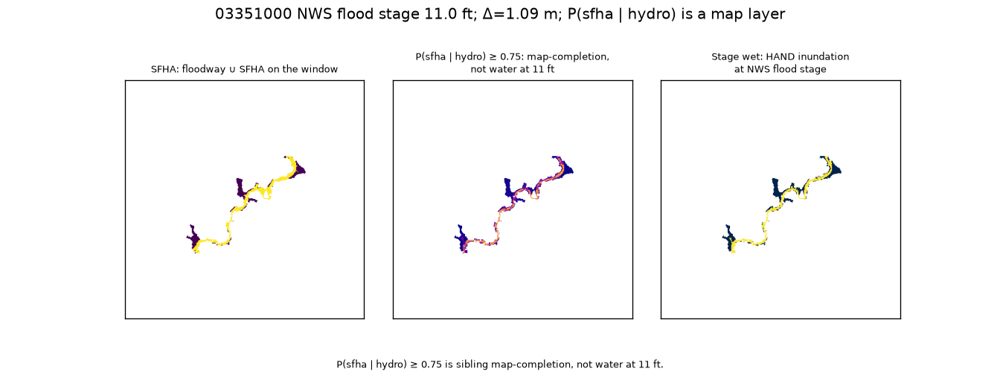
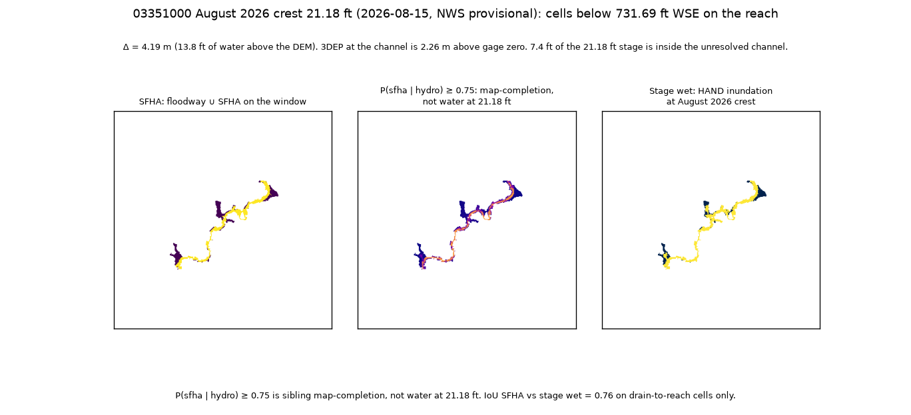

# White River stage inundation (Nora)

This tree paints one White River reach at USGS **03351000** / NWS **NORI3** (Nora, IN) from sibling HAND plus the gage rating. Wet cells drain along D8 to that 5 km window, have finite HAND, and sit below `Δ = WSE − h_channel`. `h_channel` is the sibling DEM at the White River cell nearest the gage, not gage zero.

WSE is gage zero plus stage in NAVD88: 710.51 + 11.0 = **721.51 ft** at NWS flood stage.

Flood stage is a tight bathtub: Δ = **1.09 m** (3.6 ft of water above the 30 m DEM). 1197 of 2604 drain-to-reach cells are wet. IoU vs SFHA is 0.73 on that strip.

The August 2026 crest is **21.18 ft** on 2026-08-15 (NWS provisional): WSE = **731.69 ft**, Δ = **4.19 m**, 1876 wet. Extra 679 wet cells filled leftover SFHA (dry 369 to 50); unshaded X wet 38 to 338. IoU 0.73 to 0.76 on drain-to-reach.

`P(sfha | hydro)` is a map-completion layer, not water at 11 ft and not water at 21.18 ft.

| Quantity | Flood stage 11.00 ft | Crest 21.18 ft |
|----------|---------------------:|---------------:|
| WSE (ft NAVD88) | 721.51 | 731.69 |
| h_channel (m) | 218.82 | 218.82 |
| Delta (m) | 1.09 | 4.19 |
| Wet cells | 1197 | 1876 |
| Drain-to-reach | 2604 | 2604 |
| SFHA dry at stage | 369 | 50 |
| Unshaded X wet | 38 | 338 |
| IoU SFHA vs wet | 0.73 | 0.76 |

IoU is on drain-to-reach cells only. Same window, same `h_channel`, same HAND grid.



Figure 1. Cells below 721.51 ft WSE on the 5 km reach.

- SFHA: mapped floodway ∪ SFHA on the window.
- P ≥ 0.75: sibling map-completion, not water at 11 ft.
- Stage wet: HAND inundation at NWS flood stage.

*Note*: Δ = 1.09 m. 3DEP at the channel is 2.26 m above gage zero. 7.4 ft of the 11 ft stage sits in the unresolved channel.



Figure 2. Cells below 731.69 ft WSE on the same reach (NWS provisional, 2026-08-15).

- Same three layers. P is not water at 21.18 ft.
- Extra 679 wet cells filled leftover SFHA (dry 369 to 50); unshaded X wet 38 to 338.
- IoU 0.73 to 0.76 on drain-to-reach.

Live rasters under `logs/*/rasters/` and `*.tif` stay gitignored; `logs/nora_live/three_wet.png` and `logs/nora_live/three_wet_crest_2026-08-15.png` are the committed figures.

Related tree: https://github.com/martialsystems/indiana_flood_completion (HUC-8 05120201 map completion; same HAND grid).

Three-tree summary: https://gist.github.com/martialsystems/16584e78d079666f7e8994b4cc6158be

Limitations:

- 30 m HAND: the unresolved 7.4 ft of stage is inside the channel, not on the floodplain.
- Window D8 is rebuilt from DEM plus HAND=0 paint; not byte-identical to sibling Stage B. HAND is not recomputed.
- Crest 21.18 ft is NWS provisional.
- One gage, two stages. No third Delta, no second HUC, no citywide roads.

| File | Role |
|------|------|
| [METHODOLOGY.md](METHODOLOGY.md) | Locked contract |
| [AGENTS.md](AGENTS.md) | Agent rules |
| [CHECKLIST.md](CHECKLIST.md) | Operator list |
| `src/stageflood/` | Rating, window, D8 drain, paint, claims |
| `stageforge/` | GraphForge pin |
| [docs/interview_note.pdf](docs/interview_note.pdf) | Nora note (this tree only) |

## Stage 0

```bash
python3.12 -m venv .venv
source .venv/bin/activate
pip install -r requirements.txt
PYTHONPATH=src:. python3 scripts/run_fixture.py logs/stage0_fixture
.venv/bin/python -m pytest tests -q
```

Hard gate: fixture channel wet and bank dry, claim scan clean, product laws allow Stage 0. See METHODOLOGY.md.

Live sibling rasters (gitignored in https://github.com/martialsystems/indiana_flood_completion):

```bash
PYTHONPATH=src:. python3 -c "from stageflood.pipeline import check_live_sibling; print(check_live_sibling())"
PYTHONPATH=src:. python3 scripts/run_live.py logs/nora_live
PYTHONPATH=src:. python3 scripts/run_crest.py logs/nora_live
PYTHONPATH=src:. python3 scripts/build_interview_note.py
```

The fixture path is the CI join. Do not reopen HAND. Do not paint the HUC.

## Claim bans

The scanner in `stageflood.claims` fails the run if reports call `P(sfha | hydro)` a forecast, call the HAND wet mask a FIRM, or use 100-year exceedance, site-level flood risk, casualty, climate, or population-at-risk language.

## GraphForge

Pin: `stageforge/`. Verify-before-done is the finish gate.

## Legal

Copyright (c) 2026 Martial Systems LLC. MIT. See [LICENSE](LICENSE).
